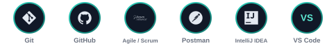
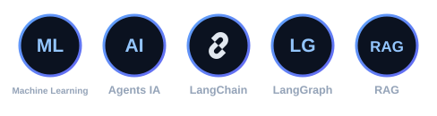

# Halima Er-Reguigue

**Élève ingénieure · Développeuse Full-Stack**

Java · Spring Boot · Angular · React.js

---

## À propos de moi

> *« Transformer des idées en code, et du code en impact »*

Étudiante en **dernière année du cycle ingénieur en Génie Informatique** (option **Génie Informatique**) à l'**ENSA Safi**, spécialisée en développement **Full-Stack** avec **Java, Spring Boot, Angular et React.js**.
Intéressée par la conception d'applications web et les **architectures microservices**.

**Formation**

- **ENSA Safi** – Cycle ingénieur, Génie Informatique *(2024 – Présent)*
- **EST Fquih Ben Salah** – DUT Génie Informatique *(2022 – 2024)*
- **Lycée El Aamria** – Baccalauréat Sciences Physiques *(2022)*

---

## Compétences techniques

**Langages**

**Back-end**

**Front-end**

**Bases de données**

**Architectures**

**Outils et méthodes**

**Modélisation**

**Intelligence artificielle**

---

## Stages

- **MIC** – Stage Full-Stack / Agent IA *(Juil. – Août 2026)*
- **Rouandi** – Stage Full-Stack *(Juil. – Août 2025)*
- **ABH Oum Er-Rbia** – Stage Full-Stack *(Avr. – Mai 2024)*

&nbsp;&nbsp;&nbsp;&nbsp;

&nbsp;&nbsp;&nbsp;&nbsp;

---

## Statistiques GitHub

---

**Contact** · [h.erreguigue@gmail.com](mailto:h.erreguigue@gmail.com) · [LinkedIn](https://www.linkedin.com/in/halima-er-reguigue-3b1416280/)

