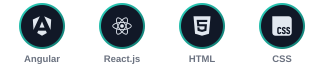
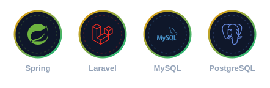

<div align="center">


<br/><br/>


<a href="https://www.linkedin.com/in/halima-er-reguigue-3b1416280/"></a>
<a href="mailto:halimaerreguigue@gmail.com"></a>

</div>

<br/>

## ✨ À propos de moi

<table>
<tr>
<td width="55%" valign="top">

```js
const halima = {
  role:       "Full-Stack Developer",
  formation:  "Cycle ingénieur – Génie Informatique & IA",
  annee:      "2ème année",
  option:     "Génie Informatique",
  focus:      ["Front-end", "Back-end", "IA"],
  pays:       "Maroc 🇲🇦",
  motto:      "Apprendre, construire, partager"
};
```

</td>
<td width="45%" valign="top">

**🌱 Ce qui me motive**

- 🚀 Créer des interfaces modernes et fluides
- 🧠 Concevoir des architectures propres
- 🔍 Résoudre des problèmes complexes
- 🤖 Explorer l'intelligence artificielle

</td>
</tr>
</table>

<div align="center">

> 💭 *« Transformer des idées en code, et du code en impact »*

</div>

<br/>

## 🧰 Compétences & Technologies

<div align="center">

**💻 Langages**


**🎨 Front-end**



**⚙️ Back-end & Bases de données**



**🛠️ Outils & Modélisation**


</div>

<br/>

## 📊 Statistiques GitHub

<div align="center">


</div>

<br/>

## 🚀 Projets

<div align="center">

<a href="https://github.com/halimaEr?tab=repositories">
  
</a>

*Ajoute ici tes projets épinglés ou un lien vers ton portfolio.*

</div>

<br/>

## 📫 Restons connectés

<div align="center">

<a href="mailto:halimaerreguigue@gmail.com"></a>
<a href="https://www.linkedin.com/in/halima-er-reguigue-3b1416280/"></a>
<a href="https://github.com/halimaEr"></a>

**N'hésitez pas à me contacter pour collaborer sur des projets passionnants !**

<br/>


⭐ *Si vous aimez mes projets, laissez une étoile !*

</div>
